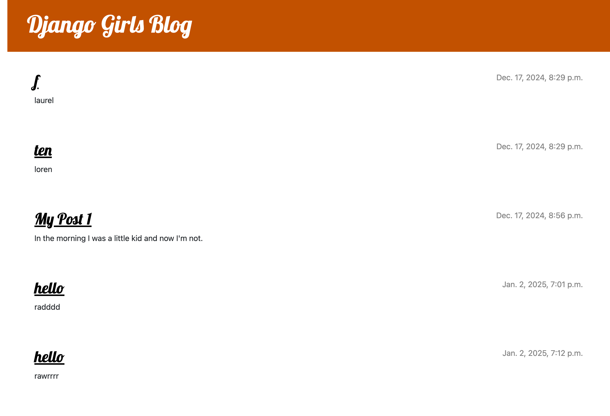

# Django Girls Blog Tutorial

## Description
In this project, I learned how to create a blog and add posts through the Django Girls site. I used: HTML, CSS, Python, and Django to create a functional blog online. 

## Screenshot of completed project

